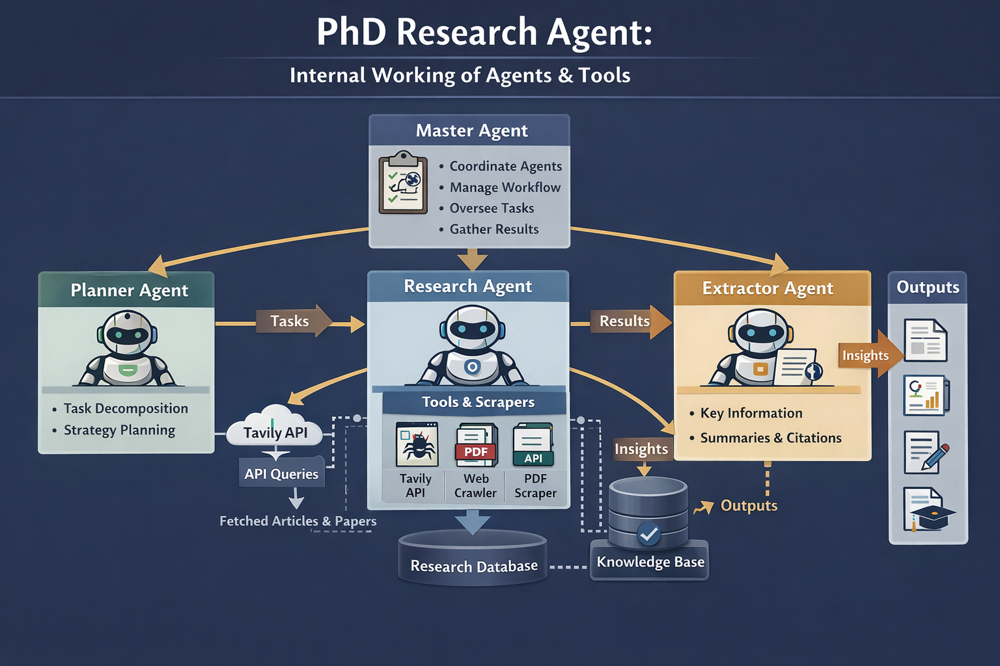

# 🕵️‍♂️ Recon Crew: PhD Multi-Agent System



### **What is this?**
An autonomous AI agent workforce that finds PhD positions across Europe. Instead of just scraping links, it **researches** like a human—finding specific professor emails, lab addresses, and funding details that Google usually misses.

---

### **🚀 Key Features**
* **Recursive Search:** Finds a university portal, then "clicks" into lab pages automatically.
* **Deep Extraction:** Pulls PI (Professor) names, emails, and phone numbers.
* **No "See Website":** Forces the AI to describe deadlines and funding instead of giving generic links.
* **PDF Reports:** Generates a professional research report automatically.

---

### **📄 Sample Report**
Check out a real report generated for Portugal:  
👉 **[Download Sample Report](Report_portugal_2026_111123.pdf)**

---

### **🛠 Tech Stack**
* **Orchestration:** LangGraph (State Machine)
* **Intelligence:** LangChain & Pydantic
* **Scraping:** Playwright & BeautifulSoup4
* **Output:** FPDF2

---

### **🏁 Quick Start**

1. **Install Gear:**
```bash
pip install -r requirements.txt
playwright install chromium

2. **Set API Key (.env):**
```bash
OPENAI_API_KEY=your_key_here

3. **Run the Crew:**
```bash
python main.py